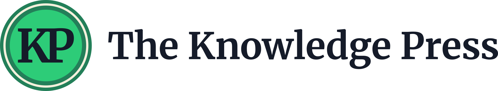
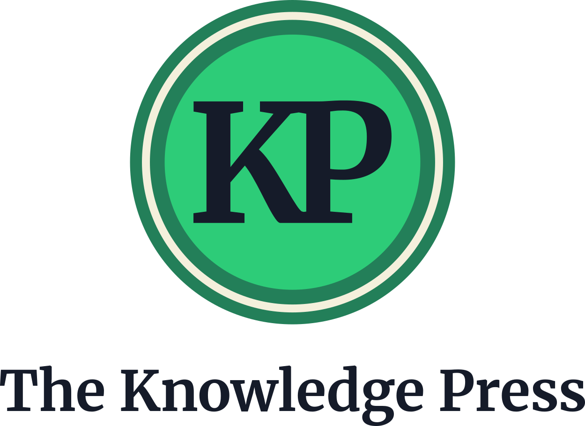
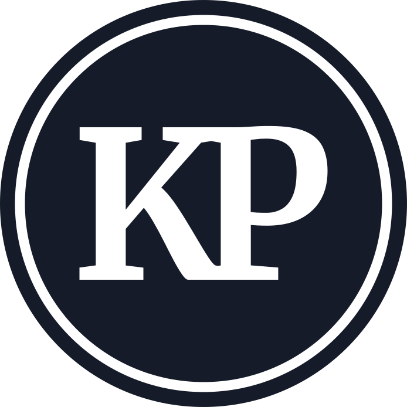
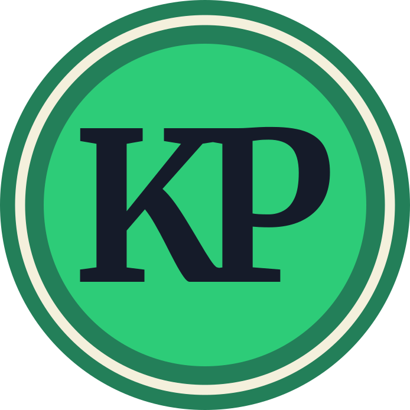

# The Knowledge Press brand

<picture>
  <source media="(prefers-color-scheme: dark)" srcset="lockup-horizontal-paper.svg">
  
</picture>

The mark is the **press seal**: a KP ligature in a ringed green disc, the
way a printer signed a book. These files are the marks, lockups and colors
to use wherever The Knowledge Press is named. They are trademarks of Eric G.
Suchanek, PhD (Flux-Frontiers); see [TRADEMARK.md](../../TRADEMARK.md)
before using them outside this project.

## Files

| File | What | Use it on |
|---|---|---|
| `seal.svg` | The seal in full color | Any solid ground |
| `seal-ink.svg` | The seal in one color, navy, rule and KP knocked out | Light grounds, single-ink print, embossing |
| `seal-paper.svg` | The seal in one color, cream, rule and KP knocked out | Dark grounds, single-ink print |
| `wordmark-ink.svg` | "The Knowledge Press" in navy | Light grounds |
| `wordmark-paper.svg` | "The Knowledge Press" in cream | Dark grounds |
| `lockup-horizontal-ink.svg` | Seal and name side by side, navy name | Light grounds; headers, signatures |
| `lockup-horizontal-paper.svg` | The same, cream name | Dark grounds |
| `lockup-stacked-ink.svg` | Seal over name, navy name | Light grounds; title pages, square spaces |
| `lockup-stacked-paper.svg` | The same, cream name | Dark grounds |
| `colors.css` | The four colors as CSS custom properties | Web |
| `fonts/` | Merriweather Bold, the face of the KP and the name, with its license (`OFL.txt`) | Rebuilding |
| `build.py` | Writes every SVG above, and the KP in the app icon and favicon | See [Rebuilding](#rebuilding) |

The app icon is not here. Its sources are `app/icon/press-seal.svg` (the seal
on the navy square) and `press-seal-macos.svg` (the macOS tile); `make icons`
renders the PNGs. The web favicon is `web/public/favicon.svg`. All three carry
the same KP, written by `build.py`.

<picture>
  <source media="(prefers-color-scheme: dark)" srcset="lockup-stacked-paper.svg">
  
</picture>
&nbsp;&nbsp;

&nbsp;&nbsp;


## The seal

Drawn on the app icon's 1024-unit grid, centered at 512, 512:

- **Outer band:** a disc of radius 347 in ring green.
- **Rule:** a cream circle of radius 313, 17 units wide.
- **Disc:** radius 273 in seal green.
- **KP:** Merriweather Bold, cap height 260, centered on the disc. The P's
  left serifs overlap the K's right edge by a tenth of an em, so the K's arm
  and leg serifs land on the P's stem and the two letters read as one mark.
  The letters are traced to outlines, so the files render the same without
  the font.

The one-color seals keep the same drawing: a solid disc of radius 347 with
the rule and the KP cut out of it, so the ground shows through.

## Color

| Name | Hex | Token | Role |
|---|---|---|---|
| Ink | `#151b29` | `--kp-ink` | The navy ground and the KP; text on light grounds |
| Ring | `#237f59` | `--kp-ring` | The seal's outer band |
| Seal | `#2dcc78` | `--kp-seal` | The seal's disc |
| Paper | `#f4f0dc` | `--kp-paper` | The seal's rule; text on dark grounds |

## Type

The name is set in [Merriweather](https://github.com/SorkinType/Merriweather)
Bold, the face of the KP, kerned and traced to outlines. Merriweather is
licensed under the SIL Open Font License 1.1 (`fonts/OFL.txt`), which permits
its use in logos and marks. Use the wordmark files rather than typing the name in a font; in
running text, write "The Knowledge Press" in whatever face the text uses.

## Clear space and size

- **Clear space:** keep a quarter of the seal's diameter clear on every side
  of the seal or lockup. Measure it from the seal as it appears in that
  lockup.
- **Seal:** 32 px across at the smallest. Below that the KP stops reading as
  letters; 16 px is for favicons only.
- **Horizontal lockup:** 32 px tall at the smallest.
- **Stacked lockup:** 120 px tall at the smallest.
- **Wordmark:** 14 px tall at the smallest.

## Do not

- Recolor the seal, or use colors other than the four above.
- Stretch, rotate, outline or add effects to any mark.
- Take the KP out of the seal, or set the name in another face.
- Put the full-color seal on a busy photo; give it a solid ground.
- Use the GutenbergKG graph mark (the "G" at a hub) for The Knowledge Press.
  That was GutenbergKG's brand, and the seal replaced it.

## Rebuilding

`build.py` traces the KP and the name from `fonts/Merriweather-Bold.ttf`
and writes every SVG in this folder, plus the KP in `app/icon/press-seal.svg`,
`app/icon/press-seal-macos.svg` and `web/public/favicon.svg`, so the brand
marks, the app icon and the favicon share one KP. The seal's proportions and
the KP's size and overlap are constants at the top of the script. After a
rebuild, run `make icons` (macOS) to re-render the app icon PNGs. `build.py`
itself runs anywhere, with two packages:

```
python3 -m venv /tmp/kp-brand && /tmp/kp-brand/bin/pip install fonttools uharfbuzz
/tmp/kp-brand/bin/python assets/brand-system/build.py
```

The output is deterministic: rebuilding without changes leaves the files
byte-identical.
