# Book gallery

Sixteen trees from the forest, chosen for what they show about how a book
becomes a tree, and for the weight the books carry. Each picture is the tree
alone, at midday in summer, with every passage drawn as a leaf.

All sixteen are photographed from the same distance, 57.7 m, at the same
height, so their sizes compare directly: a tree that looks small here is small
in the forest. The lantern cart parked beside each trunk is the same cart
you drive, 1.9 m long, for scale. Every entry links into the forest beside its tree; see
[Link to a tree](finding.md#link-to-a-tree).

The size of a tree follows its **chunks**, the passages the corpus indexed the
book into, one leaf each. Its shape follows its **species**, which the genre
decides; see [The forest](the-forest.md#a-genre-is-a-species).

## The Diary of Samuel Pepys

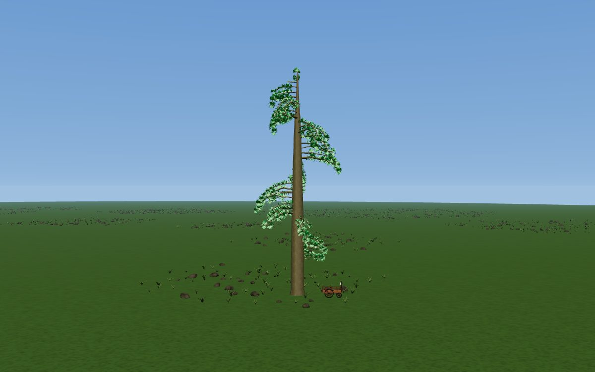

Samuel Pepys · Diaries · silver birch · 18,517 chunks

The largest book in the corpus by far, with nearly twice the chunks of the
next. It grows as a diary does: one limb per calendar year, spiraling up a
single trunk, with each day's entries hung along its year. That makes a tall
column with coils of leaves, not a wide crown.

[Open in the forest](https://flux-frontiers.github.io/knowledge_press/?tree=the_diary_of_samuel_pepys_complete)

## War and Peace

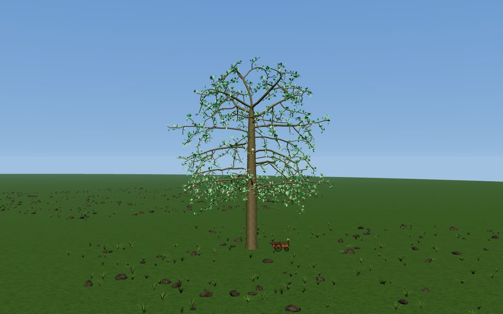

Leo Tolstoy · Russian literature · silver birch · 7,846 chunks

The largest novel in the corpus. Compare it with Pepys, which has the same
species: a novel's chapters branch into a full crown where a diary's years
climb a trunk. *Les Misérables* (7,636 chunks) is nearly the same size.

[Open in the forest](https://flux-frontiers.github.io/knowledge_press/?tree=war_and_peace)

## Moby Dick

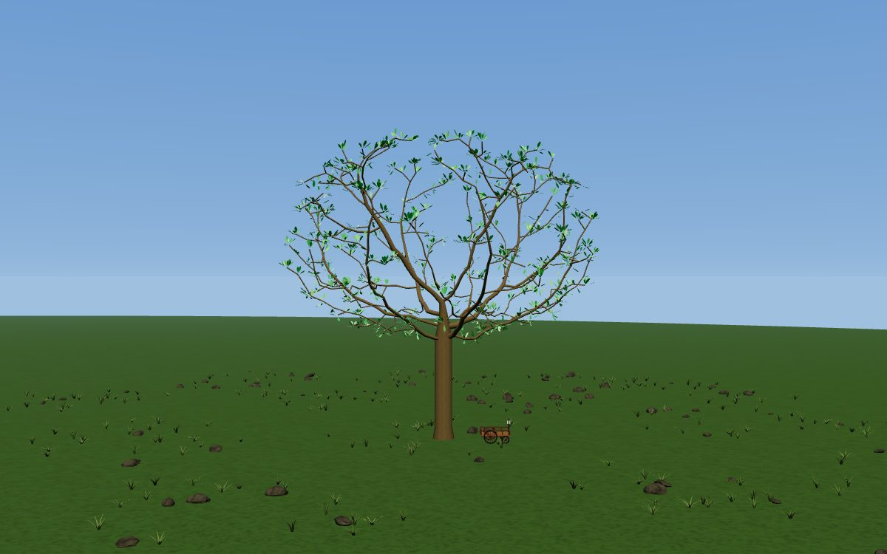

Herman Melville · American literature · horse chestnut · 2,922 chunks

The largest tree in the American literature grove. The horse chestnut grows a
full, rounded crown on a medium trunk.

[Open in the forest](https://flux-frontiers.github.io/knowledge_press/?tree=moby_dick)

## Adventures of Huckleberry Finn

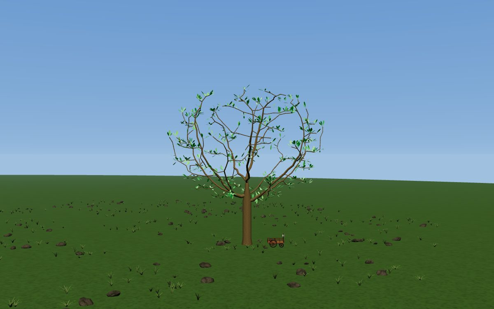

Mark Twain · American literature · horse chestnut · 1,362 chunks

The steamboat on the American literature grove's mark is for Twain. At about
half of *Moby Dick*'s chunks, the same species grows a visibly smaller crown.

[Open in the forest](https://flux-frontiers.github.io/knowledge_press/?tree=adventures_of_huckleberry_finn)

## Hamlet

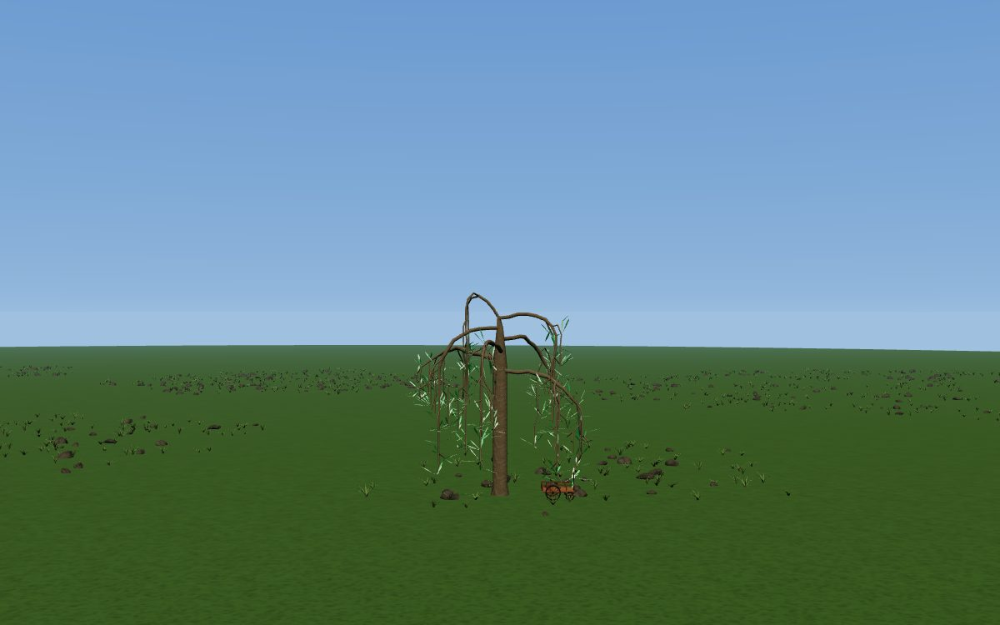

William Shakespeare · Shakespeare · weeping willow · 420 chunks

Shakespeare's plays grow as weeping willows, their limbs hanging toward the
ground. *Hamlet* has 420 leaves, and pressing it is one of the forest's
quests.

[Open in the forest](https://flux-frontiers.github.io/knowledge_press/?tree=hamlet)

## On the Origin of Species

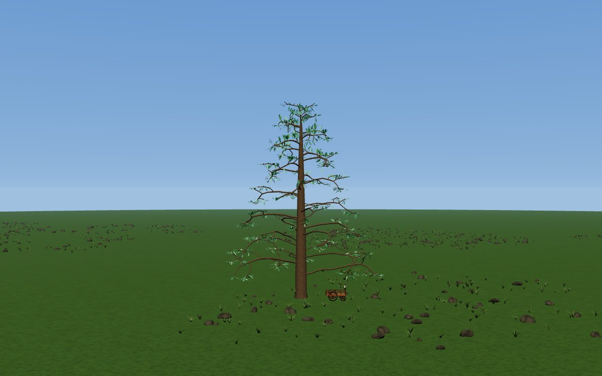

Charles Darwin · Natural history · silver fir · 2,329 chunks

A book about the tree of life, grown as a tree. The silver fir keeps one
central leader and sets its branches in level tiers around it. Darwin's
*Descent of Man* and *Voyage of the Beagle* stand in the same grove.

[Open in the forest](https://flux-frontiers.github.io/knowledge_press/?tree=on_the_origin_of_species_charles_darwin)

## Frankenstein

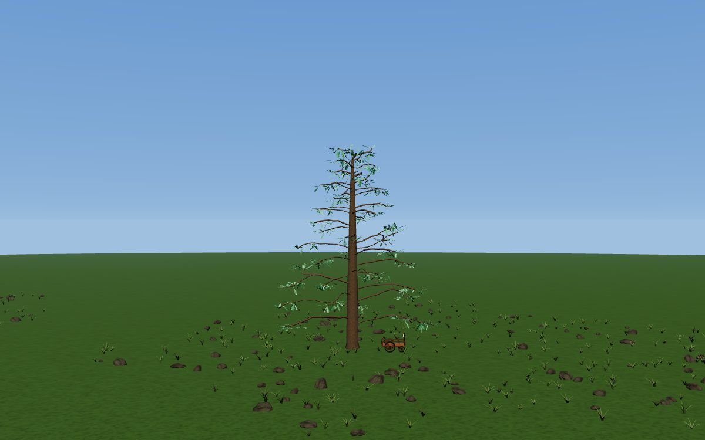

Mary Wollstonecraft Shelley · Science fiction · silver fir · 1,022 chunks

Science fiction grows as silver fir, like natural history, so *Frankenstein*
and *Origin of Species* are the same species at different sizes. Mary
Shelley's mother wrote *A Vindication of the Rights of Woman*, further down
this page.

[Open in the forest](https://flux-frontiers.github.io/knowledge_press/?tree=frankenstein)

## The Divine Comedy, two translations

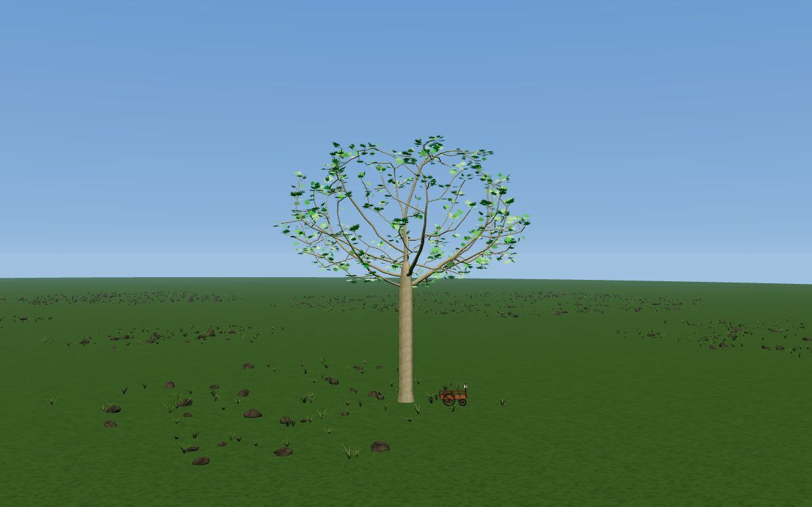

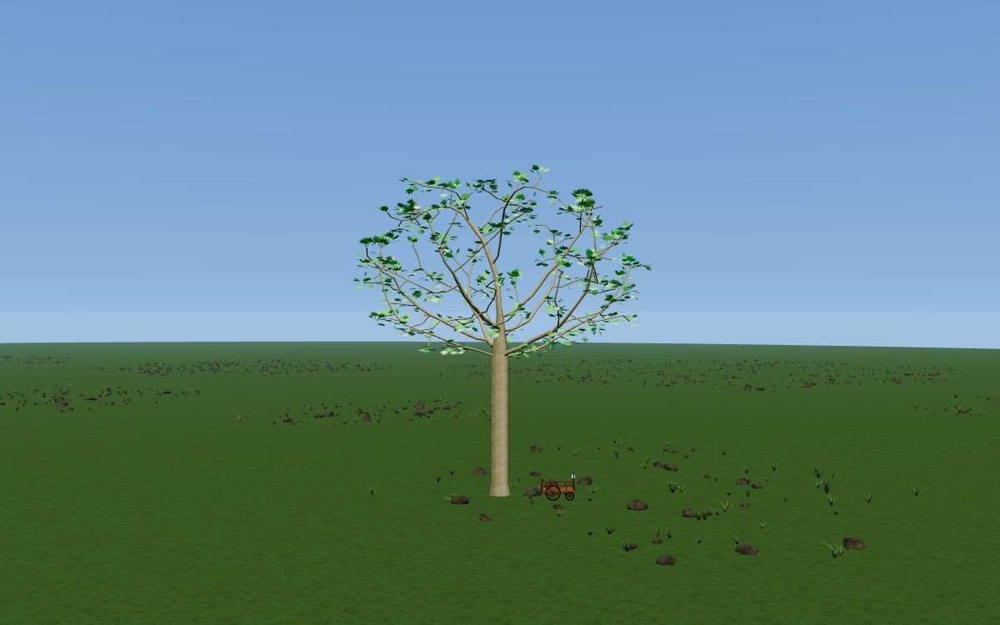

Dante Alighieri · World literature · London plane · 1,476 chunks (Cary) and
1,440 chunks (Longfellow)

The same poem, translated twice, grows as two trees. The top picture is Henry
Cary's translation and the bottom is Longfellow's. They are nearly the same
size and shape: the poem's structure of cantos decides the tree, and the
translators' wording only moves it by a few dozen leaves.

[Open Cary's in the forest](https://flux-frontiers.github.io/knowledge_press/?tree=the_divine_comedy_carys_translation) ·
[Open Longfellow's in the forest](https://flux-frontiers.github.io/knowledge_press/?tree=the_divine_comedy_longfellows_translation)

## Don Quixote

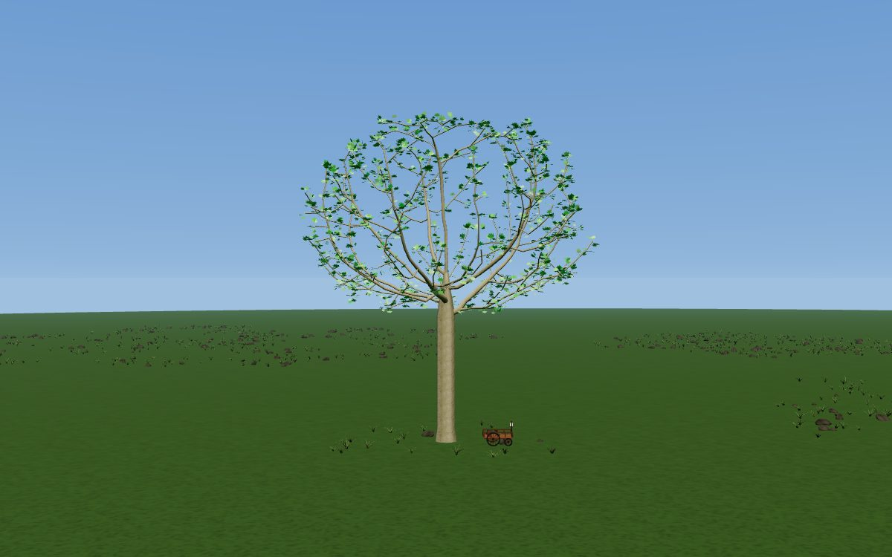

Miguel de Cervantes Saavedra · Spanish literature · London plane · 4,032 chunks

The only book in the Spanish literature grove, so a whole grove, signpost and
mark belong to one tree. The mark on its plaza is a windmill.

[Open in the forest](https://flux-frontiers.github.io/knowledge_press/?tree=don_quixote)

## A Modest Proposal

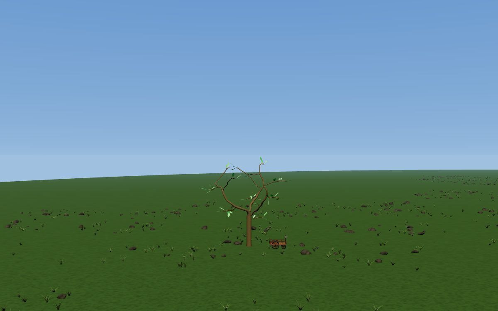

Jonathan Swift · English literature · horse chestnut · 52 chunks

The smallest book in the corpus, a sapling beside the others. Photographed at
the same distance as Pepys and *War and Peace*, it shows what 52 leaves look
like against thousands.

[Open in the forest](https://flux-frontiers.github.io/knowledge_press/?tree=a_modest_proposal)

## The Republic

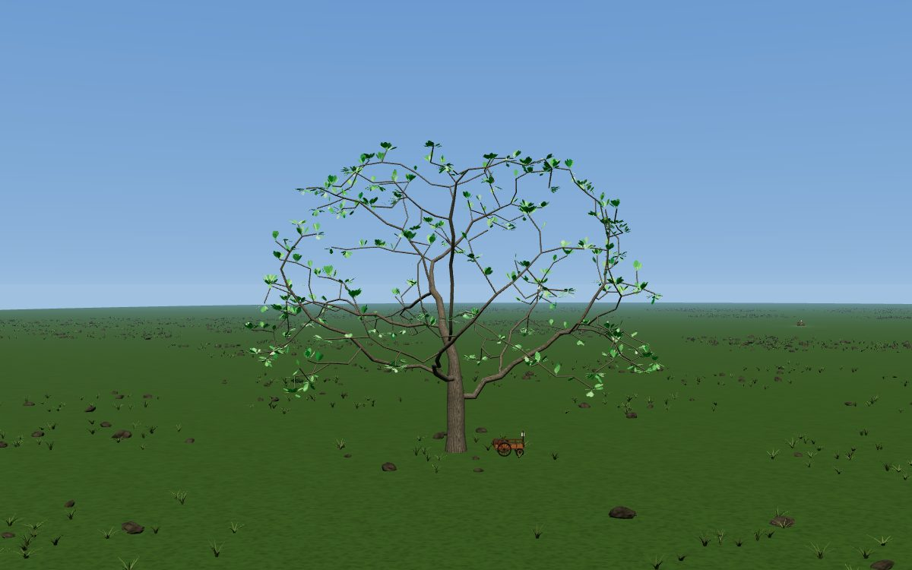

Plato · Philosophy · English oak · 2,900 chunks

Philosophy grows as English oak: a short trunk and long limbs reaching out
wide and low. Philosophy is the forest's largest grove, with 39 books.

[Open in the forest](https://flux-frontiers.github.io/knowledge_press/?tree=the_republic)

## The Bible

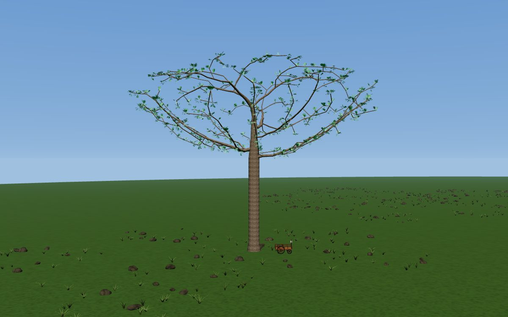

Various · Sacred texts · stone pine · 6,696 chunks

The stone pine spreads a wide, flat crown on a tall bare trunk, and *The
Bible* is the widest tree on this page. The sacred texts grove also holds
*The Quran* (2,649 chunks) and the *Tao Te Ching* (142), one of the smallest
trees in the forest.

[Open in the forest](https://flux-frontiers.github.io/knowledge_press/?tree=the_bible)

## One Thousand and One Nights

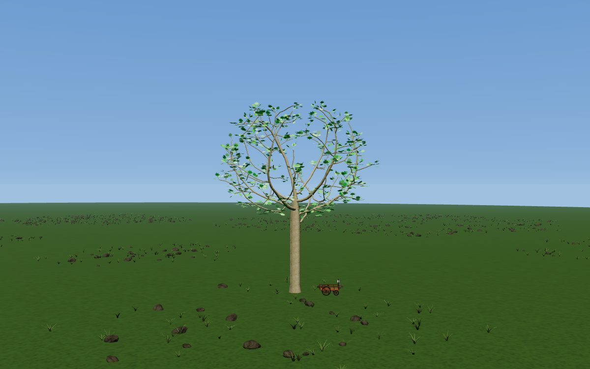

World literature · London plane · 1,457 chunks

Stories told within stories, grown as a tree of limbs within limbs. It stands
in the world literature grove with the two *Divine Comedy* translations.

[Open in the forest](https://flux-frontiers.github.io/knowledge_press/?tree=one_thousand_and_one_nights_lane_translation)

## Narrative of the Life of Frederick Douglass

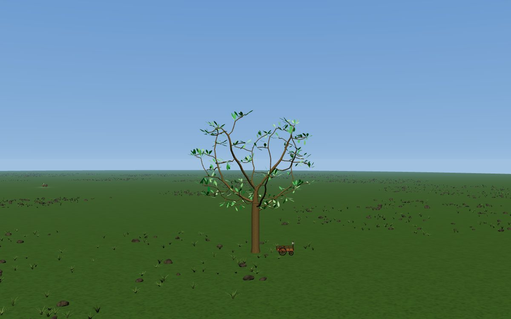

Frederick Douglass · Biography · horse chestnut · 524 chunks

A short book, and a small tree, that changed the argument over slavery in
the United States. It stands in the biography grove.

[Open in the forest](https://flux-frontiers.github.io/knowledge_press/?tree=narrative_of_the_life_of_frederick_douglass)

## A Vindication of the Rights of Woman

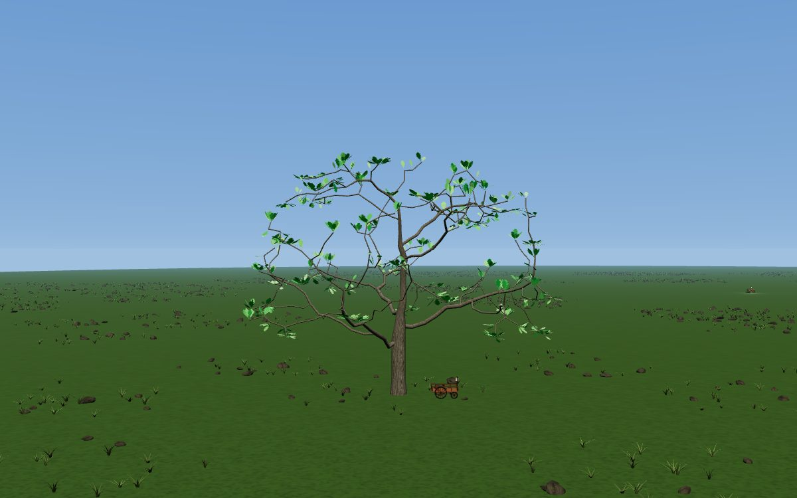

Mary Wollstonecraft · Philosophy · English oak · 1,281 chunks

Wollstonecraft's 1792 argument for the education of women grows in the
philosophy grove. Her daughter, Mary Shelley, wrote *Frankenstein*; the two
trees are in different groves and different species.

[Open in the forest](https://flux-frontiers.github.io/knowledge_press/?tree=a_vindication_of_the_rights_of_woman_wollstonecraft)

## Making the pictures

The pictures are rendered by the forest itself, in its `?shot=` mode, which
shows one tree, with the cart beside it and nothing else of the forest. To render them
again after the trees change, with the dev server running:

```
cd web
npm i --no-save puppeteer-core
node scripts/gallery.mjs
```

`make docs-gallery` runs the same script. It drives the installed Google
Chrome with software WebGL and writes one JPEG per book into
`docs/assets/trees/`.
